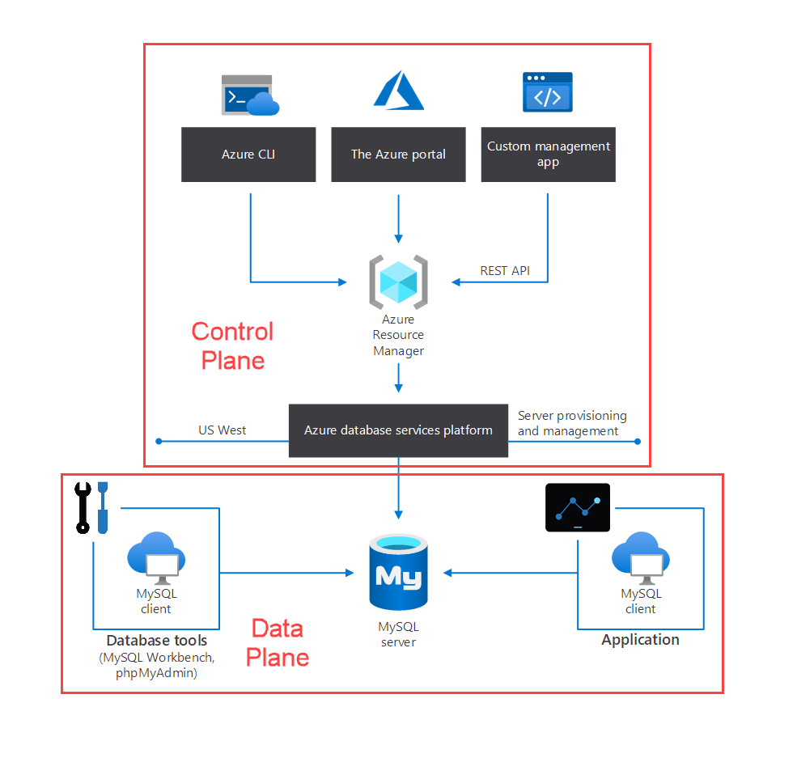

# Introduction to Azure Database for MySQL

As mentioned previously, developers can deploy MySQL on Azure through Virtual Machines (IaaS) or Azure Database for MySQL (PaaS). Though PaaS offerings do not support direct management of the OS and the database engine, they have built-in support for high availability, automating backups, and meeting compliance requirements. Moreover, Azure Database for MySQL supports MySQL Community Editions 5.6, 5.7, and 5.8. For most use cases, Azure PaaS MySQL allows developers to focus on application development and deployment, instead of OS and RDBMS management, patching, and security.

As the image below demonstrates, Azure Resource Manager handles resource configuration, meaning that standard Azure management tools, such as the CLI, PowerShell, and ARM templates, are still applicable. This is termed the *control plane*.

For managing database objects and access controls on those objects, standard MySQL management tools, such as [MySQL Workbench](https://www.mysql.com/products/workbench/), still apply. This is known as the *data plane*.

