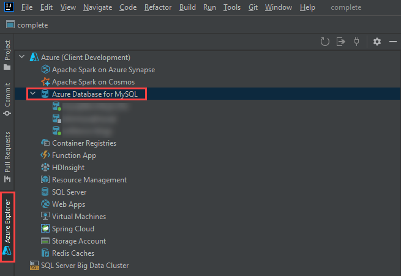
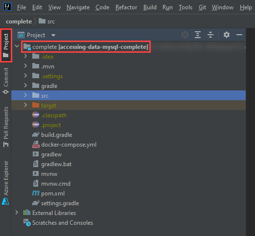
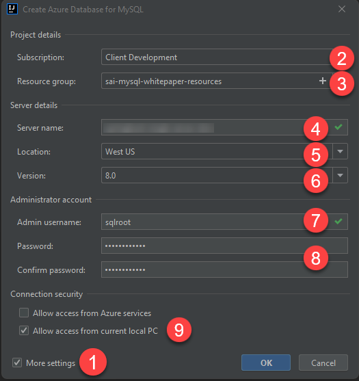
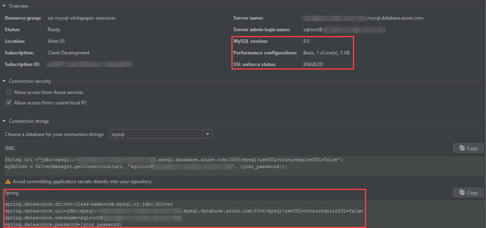
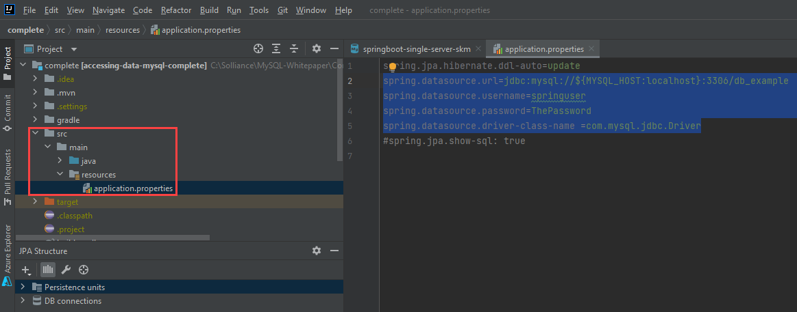
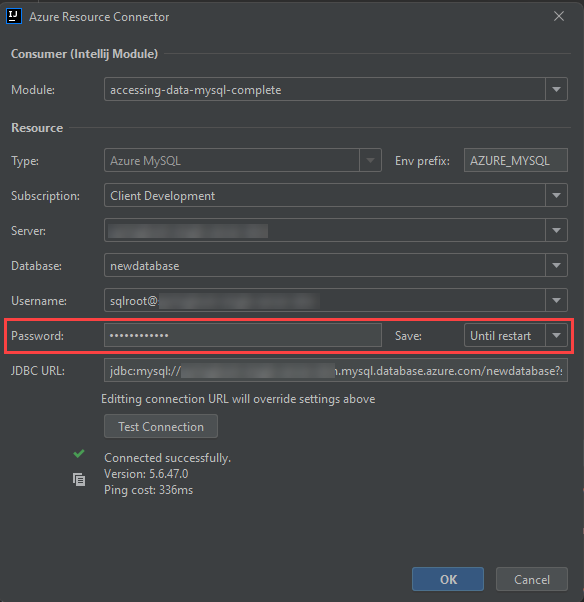

# Java (Spring Boot) Language Support

This guide will demonstrate how to operate a Spring Framework application that queries Azure Database for MySQL through Spring Data JPA. We will also present Azure extensions for popular Java development tools.

## Setup

### IntelliJ Setup

Download the [IntelliJ IDEA](https://www.jetbrains.com/idea/download) IDE. Community edition will suffice. It comes with a custom JDK, so it is not necessary to install the JDK separately.

After installing IntelliJ, install the [Azure Toolkit for IntelliJ](https://plugins.jetbrains.com/plugin/8053-azure-toolkit-for-intellij/) plugin. Then, authenticate with Azure, as described in [this](https://docs.microsoft.com/azure/developer/java/toolkit-for-intellij/sign-in-instructions) document.

Once everything is equipped, you will see an **Azure Explorer** tab on the left side of the screen. Note that it is possible to manage Azure Database for MySQL Single Server instances from the Azure Explorer.

### App Setup

Clone the [gs-accessing-data-mysql](https://github.com/spring-guides/gs-accessing-data-mysql) repository to your local machine. This is an example app from the Spring documentation.

Open the `complete` directory in the repository root in IntelliJ. If you are prompted to choose between using the Maven configuration or the Gradle configuration, choose the Maven one.

### Database Setup

The IntelliJ Azure explorer supports Azure Database for MySQL Single Server, but not Flexible Server. Luckily, you can provision a Single Server instance directly within the Azure Explorer.

1. Navigate to the **Azure Explorer** tab, right-click on **Azure Database for MySQL**, and select **+ Create**.

2. The **Create Azure Database for MySQL** dialog box will open. Select **+ More settings** (1) and populate the following parameters:

    - **Project details**
      - **Subscription** (2)
      - **Resource group** (3): choose an existing resource group from the dropdown or create a new one by pressing **+**
    - **Server details**
      - **Server name** (4): provide a unique value, like `springboot-single-server-SUFFIX`
      - **Location** (5): choose an Azure location near you
      - **Version** (6): choose `8.0`
    - **Administrator account**
      - **Admin username** (7): enter `sqlroot`
      - **Password/confirm password** (8): choose a secure password
    - **Connection security**
      - Select **Allow access from current local PC** (9)

    

3. Select **OK**. Allow the task to continue in the background.

4. Once provisioning completes (it should only take a few minutes), observe the new MySQL Single Server instance appear in the Azure explorer. Right-click the instance and select **Show properties**. A panel will open with basic information about the instance, including Spring connection information for the `application.properties` file.

    

## Run the App

1. Open `application.properties` from the project hierarchy: `src` > `main` > `resources`. Delete all the `spring.datasource.*` entries.

    

2. Navigate to the **Azure Explorer**, right-click the Single Server instance you provisioned, and select **Connect to Project (Preview)**.

3. In the **Azure Resource Connector** window, keep all parameters the same. Simply populate the **Password**. Then, select **OK**.

    
