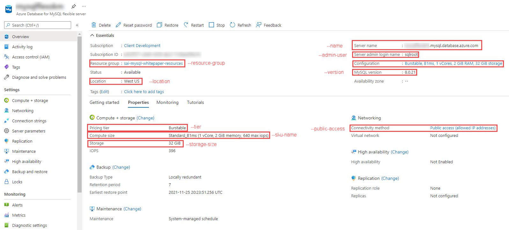

# Provision Flexible Server and Database

This document illustrates how to deploy MySQL Flexible Server using various Azure management tools.

## Azure Portal - TODO

## Azure CLI

The Azure CLI `az mysql flexible-server` set of commands is very robust. [Azure's quickstart guide](https://docs.microsoft.com/azure/mysql/flexible-server/quickstart-create-server-cli) demonstrates how the `az mysql flexible-server create` and `az mysql flexible-server db create` commands can automatically populate server parameters. You can also employ the Bash shell commands below to provide greater configuration over the deployed Flexible Server. They will create a new resource group if the given one does not already exist. Fill in the placeholders to use them.

The command requires your current client public IP address to create a firewall rule to allow you to access the database. You can access it at [this](http://whatismyip.akamai.com/) link.

> You can execute Azure CLI commands using the [Azure Cloud Shell](shell.azure.com/bash) or install the CLI tools locally.

```bash
resourceGroup=""
location=""
# Unique resource identifier
suffix=""
# Client IP address
clientIp=""

username="sqlroot"
# sqlroot password
password=""

serverName="mysqlflex${suffix}"
skuName="Standard_B1ms"
tierName="Burstable"

az mysql flexible-server create --location $location --resource-group $resourceGroup --name $serverName --admin-user $username --admin-password $password --sku-name $skuName --tier $tierName --publicAccess $clientIp --storage-size 32 --version 8.0.21

az mysql flexible-server db create --resource-group $resourceGroup --server-name $serverName --database-name newdatabase
```

After the commands finish executing, observe that the Flexible Server instance provisioned as expected.



## ARM Template - TODO
